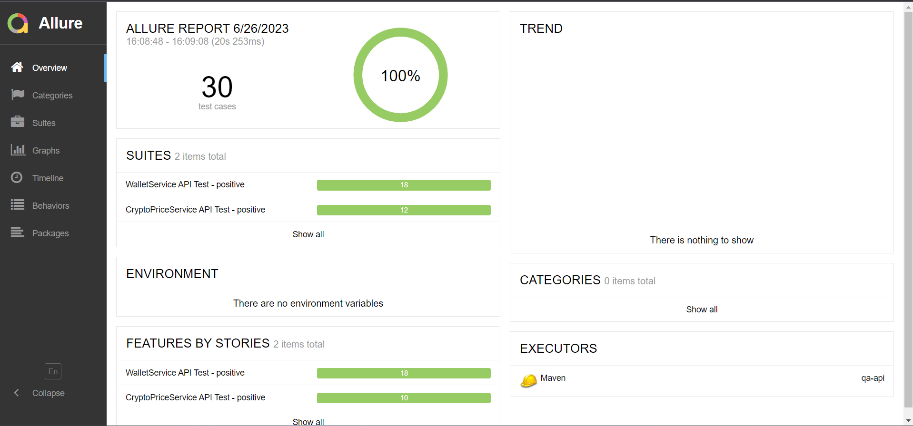

# QA-API tests

[](https://github.com/kargolek/crypto-portfolio-microservices/actions/workflows/qa-main-test.yaml)

### Description

This test framework is built with RestAssured, Cucumber, JUnit5, and Allure. It is designed to automate API microservices tests and provide detailed test reports.

### Features

- Automated testing with RestAssured, Cucumber
- Test execution with JUnit5
- Detailed test reports with Allure

### Test report
1. Regression latest: https://kargolek.github.io/crypto-portfolio-microservices/regression/
2. Main latest: https://kargolek.github.io/crypto-portfolio-microservices/main/

### Example
```gherkin
@crypto_price_service_api_test_positive_db
@crypto_price_service_api_test
Feature: CryptoPriceService API Test - positive

  Background: The system has db data default
    Given crypto price service db data deleted
    And adding token data to db
      | id | name      | symbol | coinMarketId | platform | tokenAddress                               | priceId | priceCurrent | percentChange1h | percentChange24h | percentChange7d | percentChange30d | percentChange60d | percentChange90d |
      | 1  | Ethereum  | ETH    | 1027         | ethereum | 0x2170Ed0880ac9A755fd29B2688956BD959F933F8 | 1       | 2000.12345   | 5.5             | -5.5             | 10.5            | -10.5            | 15.5             | -15.5            |
      | 2  | Polygon   | MATIC  | 3890         |          |                                            | 2       | 1.12345      | 5.5             | -5.5             | 10.5            | -10.5            | 15.5             | -15.5            |
      | 3  | Avalanche | AVAX   | 5805         |          |                                            | 3       | 20.12345     | 5.5             | -5.5             | 10.5            | -10.5            | 15.5             | -15.5            |

  @severity=critical
  Scenario: As user GET resource /cryptocurrency
    Given valid API endpoint
    When send GET request to path "/cryptocurrency"
    Then receive status code 200
    And receive data is json format
    And receive valid array json data for crypto-price
      | id | name      | symbol | coinMarketId | platform | tokenAddress                               | priceId | priceCurrent | percentChange1h | percentChange24h | percentChange7d | percentChange30d | percentChange60d | percentChange90d |
      | 1  | Ethereum  | ETH    | 1027         | ethereum | 0x2170Ed0880ac9A755fd29B2688956BD959F933F8 | 1       | 2000.12345   | 5.5             | -5.5             | 10.5            | -10.5            | 15.5             | -15.5            |
      | 2  | Polygon   | MATIC  | 3890         |          |                                            | 2       | 1.12345      | 5.5             | -5.5             | 10.5            | -10.5            | 15.5             | -15.5            |
      | 3  | Avalanche | AVAX   | 5805         |          |                                            | 3       | 20.12345     | 5.5             | -5.5             | 10.5            | -10.5            | 15.5             | -15.5            |

```

### How to run API tests locally

#### *Preconditions:*
1. Navigate to project root path: **crypto-portfolio-microservices**
2. Run **build.bat** file to start app docker containers and mysql db
```shell
start build.bat
```

#### *Main steps:*
1. Navigate to path
```shell
cd quality-assurance/qa-api
```
2. Run tests via maven
```shell
mvn clean test
```
3. Or filter tests by tags run it via command
```shell
mvn clean test -Dgroups="wallet_service_api_test_positive | crypto_price_service_api_test_positive"
```
4. Run and open allure test report
```shell
mvn allure:serve
```
#### *Example test report*
