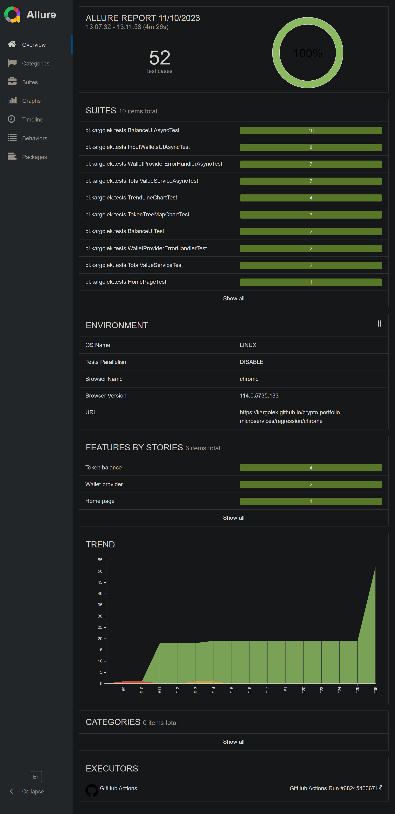
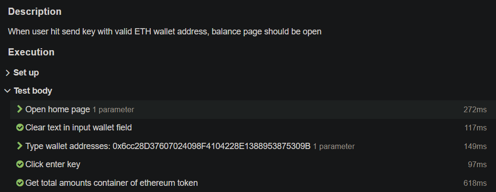
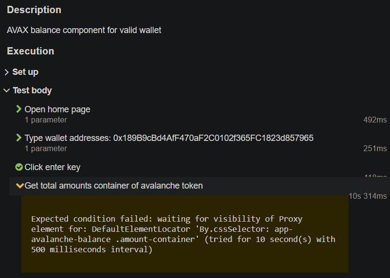
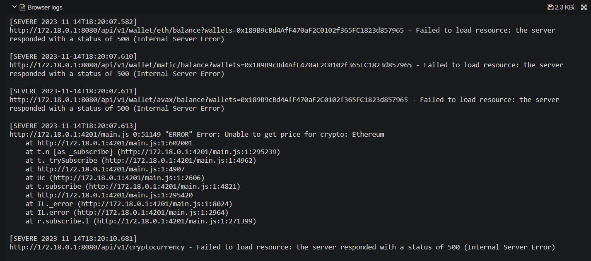
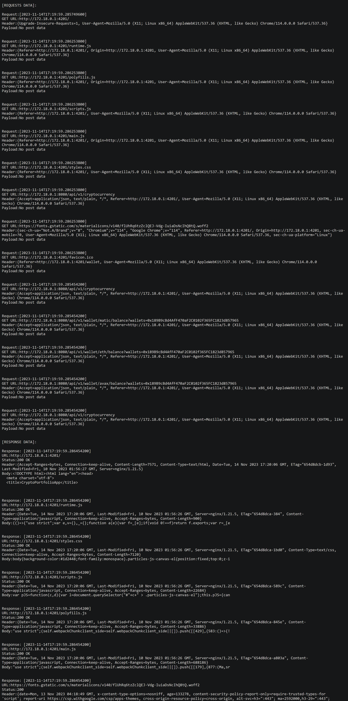
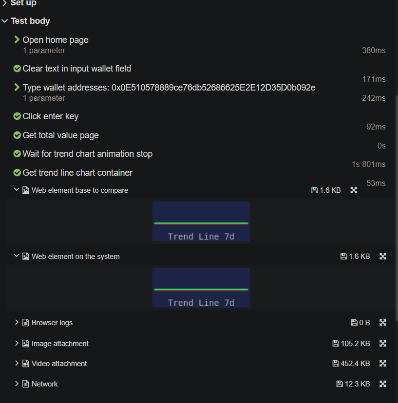
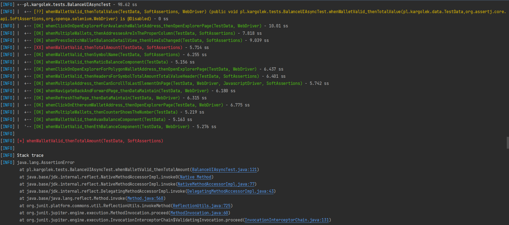

# QA-UI
[](https://kargolek.github.io/crypto-portfolio-microservices/main/)
[](https://kargolek.github.io/crypto-portfolio-microservices/regression/chrome)
[](https://kargolek.github.io/crypto-portfolio-microservices/regression/edge)
[](https://kargolek.github.io/crypto-portfolio-microservices/regression/firefox)

## Description
The test framework is built using **Selenium 4.10, JUnit5, Maven Surefire and Allure**. It is designed to automate crypto-portfolio web application testing and provides detailed test reports.

## Key Features of the Test Framework
- Automated testing with **Selenium 4.10**
- Utilizes the **Page Object Design pattern** for maintaining clean and organized test code
- Test execution managed with **JUnit5** and **Maven Surefire** with the ability to filter tests using **tags**
- Comprehensive test report using **Allure** which includes **screenshots, video recordings (single thread), browser & network logs**
- Simple test configuration through annotations and Junit5 extensions
- Supports cross-browser testing on **Chrome, Firefox and Edge** via **GH Actions**
- Implements **Test parallelism** through **Selenium Grid** and **Junit5**
- Includes **Visual regression** created with **OpenCV** for comparing objects on webpage with expected element image
- Provided hard and soft assertion via **AssertJ**

## How to run locally
### Prerequisites
1. **Docker** should be installed
2. Run **build.bat** from ./crypto-portfolio-microservices to start app

### Running the Main Tests
1. Navigate to ./crypto-portfolio-microservices/quality-assurance/qa-ui
2. Run
```shell
mvn clean test
```
Run params example:

* Filtering test by tags
```shell
mvn test -T 2 -Dgroups="ExampleTag,ExampleTag2"     
```
* Exclude test by tags
```shell
mvn test -T 2 -Dgroups="!ExampleTag"     
```
* Choose browser type
```shell
mvn test -T 2 -Dbrowser="chrome || firefox || edge"
```
* Enable or disable headless mode
```shell
mvn test -T 2 -Dheadless="enable || disable"
```
* Network traffic listener and attach it to the test report
```shell
mvn test -T 2 -Dnetwork="enable || disable"
```
* Test parallelism enable or disable
```shell
mvn test -T 2 "-Djunit.jupiter.execution.parallel.enabled=true || false"
```

## Examples

### Example test class
```java
package pl.kargolek.tests;

import io.qameta.allure.*;
import org.junit.jupiter.api.BeforeEach;
import org.junit.jupiter.api.Tag;
import org.junit.jupiter.api.Tags;
import org.junit.jupiter.api.Test;
import org.junit.jupiter.api.parallel.Isolated;
import org.openqa.selenium.WebDriver;
import pl.kargolek.extension.BaseTestConfig;
import pl.kargolek.pages.InitPages;
import pl.kargolek.util.TestProperty;

import static org.assertj.core.api.Assertions.assertThat;

/**
 * @author Karol Kuta-Orlowicz
 */
@Tags({
        @Tag("HomePageUI"),
        @Tag("RoutingApp")
})
@Epic("Home page")
@BaseTestConfig
public class HomePageTest {

    private String appBaseURL;

    @BeforeEach
    public void setup(TestProperty property) {
        this.appBaseURL = property.getAppBaseURL();
    }

    @Test
    @Severity(SeverityLevel.BLOCKER)
    @Feature("Routing app")
    @Story("As normal user, when I open base app URL, then app redirect to URL path '/wallet'")
    @Description("Opening main URL app runs routing to /wallet path")
    public void whenOpenAppBaseURL_thenRedirectToWalletPath(WebDriver driver, InitPages pages) {
        pages.getHomePage()
                .open(this.appBaseURL);
        assertThat(driver.getCurrentUrl()).contains("/wallet");
    }
}
```
* The test class is configured using the [@BaseTestConfig](https://github.com/kargolek/crypto-portfolio-microservices/blob/main/quality-assurance/qa-ui/src/test/java/pl/kargolek/extension/BaseTestConfig.java) annotation and **Junit 5 extension feature**

### Example test report

* #### Home page

* #### Behavior page and test's overview

* #### Clearly executions steps of each tests with description

* #### Indicated step by error type

* #### Chrome browser console error logs

* #### Chrome network events

* #### Visual comparing of web elements

* #### Test execution video
https://github.com/kargolek/crypto-portfolio-microservices/assets/33175703/c0240a3f-fac8-4223-b110-358fbc7dd873
* #### Console output during execution tests

