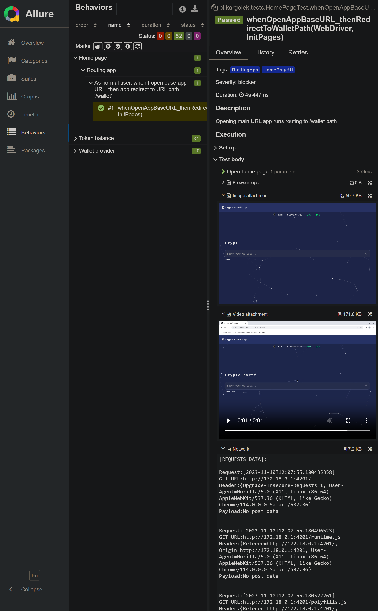

# QA-UI

[](https://kargolek.github.io/crypto-portfolio-microservices/main/)
[](https://kargolek.github.io/crypto-portfolio-microservices/regression/chrome)
[](https://kargolek.github.io/crypto-portfolio-microservices/regression/edge)
[](https://kargolek.github.io/crypto-portfolio-microservices/regression/firefox)

## Table of content

- [Description](#description)
- [Key Features](#key-features)
- [How to run locally](#how-to-run-locally)
- [How to run on GitHub Actions](#how-to-run-on-github-actions)
- [Examples](#examples)

## Description

The test framework is built using **Selenium 4.10, JUnit5, Maven Surefire and Allure**. It is designed to automate
crypto-portfolio web application testing and provides detailed test reports.

## Key features

- Automated testing with **Selenium 4.10**
- Utilizes the **Page Object Design pattern** for maintaining clean and organized test code
- Test execution managed with **JUnit5** and **Maven Surefire** with the ability to filter tests using **tags**
- Comprehensive test report using **Allure** which includes **screenshots, video recordings (single thread), browser &
  network logs**
- Simple test configuration through annotations and Junit5 extensions
- Supports cross-browser testing on **Chrome, Firefox and Edge** via **GH Actions**
- Implements **Test parallelism** through **Selenium Grid** and **Junit5**
- Includes **Visual regression** created with **OpenCV** for comparing objects on webpage with expected element image
- Provided hard and soft assertion via **AssertJ**

## How to run locally
### Prerequisites
1. **Docker** should be installed
2. Run **build.bat** from ./crypto-portfolio-microservices to start app

### Running the Main Tests
1. Navigate to ./crypto-portfolio-microservices/quality-assurance/qa-ui
2. Run
```shell
mvn clean test
```
Run params example:

* Filtering test by tags
```shell
mvn test -T 2 -Dgroups="ExampleTag,ExampleTag2"     
```
* Exclude test by tags
```shell
mvn test -T 2 -Dgroups="!ExampleTag"     
```
* Choose browser type
```shell
mvn test -T 2 -Dbrowser="chrome || firefox || edge"
```
* Enable or disable headless mode
```shell
mvn test -T 2 -Dheadless="enable || disable"
```

* Network traffic listener and attach it to the test report

```shell
mvn test -T 2 -Dnetwork="enable || disable"
```

* Test parallelism enable or disable

```shell
mvn test -T 2 "-Djunit.jupiter.execution.parallel.enabled=true || false"
```

## How to run on GitHub Actions

1. Go to
   file: [qa-regression-test-chrome](https://github.com/kargolek/crypto-portfolio-microservices/blob/main/.github/workflows/qa-regression-test-chrome.yaml)
   or
   [qa-regression-test-firefox](https://github.com/kargolek/crypto-portfolio-microservices/blob/main/.github/workflows/qa-regression-test-firefox.yaml)
   or [qa-regression-test-edge](https://github.com/kargolek/crypto-portfolio-microservices/blob/main/.github/workflows/qa-regression-test-edge.yaml)

```yaml
name: "qa-regression-test-chrome"

env:
   ####### TEST VARS #######
   TAGS: HomePageUI,TokenBalanceUI
   BROWSER_TYPE: chrome
   HEADLESS_MODE: disable
   NETWORK_LISTENER: enable
   PARALLEL_TEST: false
```

- **TAGS** tags placed in test class annotation **@Tag()**
- **BROWSER_TYPE**: chrome or firefox or edge
- **HEADLESS_MODE**: disable or enable
- **NETWORK_LISTENER**: disable or enable
- **PARALLEL_TEST**: false or true

2. In **TAGS** variable in yaml file, set test class tag that you want run, for e.g.: HomePageUI

```java

@Tags({
        @Tag("HomePageUI"),
        @Tag("RoutingApp")
})
@Epic("Home page")
@BaseTestConfig
public class HomePageTest {
}

```

3. In commit message place tag for:

- chrome: **#regressionTestChrome**
- firefox: **#regressionTestFirefox**
- edge: **#regressionTestEdge**
- for all browser: **#regressionTestAll**

```shell
git commit -am "Example commit message #regressionTestChrome"
```

```shell
git commit -am "Example commit message" -m "#regressionTestAll"
```

4. Go to [Actions](https://github.com/kargolek/crypto-portfolio-microservices/actions) and verify your branch

## Examples

### Example test class

```java
package pl.kargolek.tests;

import io.qameta.allure.*;
import org.junit.jupiter.api.BeforeEach;
import org.junit.jupiter.api.Tag;
import org.junit.jupiter.api.Tags;
import org.junit.jupiter.api.Test;
import org.junit.jupiter.api.parallel.Isolated;
import org.openqa.selenium.WebDriver;
import pl.kargolek.extension.BaseTestConfig;
import pl.kargolek.pages.InitPages;
import pl.kargolek.util.TestProperty;

import static org.assertj.core.api.Assertions.assertThat;

/**
 * @author Karol Kuta-Orlowicz
 */
@Tags({
        @Tag("HomePageUI"),
        @Tag("RoutingApp")
})
@Epic("Home page")
@BaseTestConfig
public class HomePageTest {

    private String appBaseURL;

    @BeforeEach
    public void setup(TestProperty property) {
        this.appBaseURL = property.getAppBaseURL();
    }

    @Test
    @Severity(SeverityLevel.BLOCKER)
    @Feature("Routing app")
    @Story("As normal user, when I open base app URL, then app redirect to URL path '/wallet'")
    @Description("Opening main URL app runs routing to /wallet path")
    public void whenOpenAppBaseURL_thenRedirectToWalletPath(WebDriver driver, InitPages pages) {
       pages.getHomePage()
               .open(this.appBaseURL);
       assertThat(driver.getCurrentUrl()).contains("/wallet");
    }
}
```

* The test class is configured using
  the [@BaseTestConfig](https://github.com/kargolek/crypto-portfolio-microservices/blob/main/quality-assurance/qa-ui/src/test/java/pl/kargolek/extension/BaseTestConfig.java)
  annotation and **Junit 5 extension feature**

```java

@Target({ElementType.TYPE, ElementType.METHOD})
@Retention(RetentionPolicy.RUNTIME)
@SeleniumWebDriver(isBeforeAll = false)
@MySqlScript
@TestProperties
@VideoRecording
@TakeScreenshot
@BrowserLogs
@DevTools
@InitPageObject
public @interface BaseTestConfig {
}
```

### Custom JUnit extension documentation

- **@SeleniumWebDriver** - init instance of web driver (isBeforeAll == true - init web driver before all tests
  classes)<br>It can get access to a WebDriver object by adding a WebDriver object as a method argument.

```java
@Test
public void testExample(WebDriver driver,InitPages pages){
        pages.getHomePage()
                .open(this.appBaseURL);
        assertThat(driver.getCurrentUrl()).contains("/wallet");
}
```

- **@MySqlScript** init TestDataSql instance, that it use to run sql scripts to msql database.<br>
It can be use in **beforeEach** and **test methods** by adding **TestDataSql** as method parameter.
<br><br>MySQL database server address can be configured in [conf.properties](https://github.com/kargolek/crypto-portfolio-microservices/blob/main/quality-assurance/qa-ui/src/test/resources/conf.properties)<br>To set database user and password add **MYSQL_USER** and **MYSQL_PASSWORD** as system variable
```properties
db.datasource.url=jdbc:mysql://localhost:3306/crypto_price?useSSL=false
```

```java
public class TestDataSql {

    private final MySqlDbConnector mySqlDbConnector;
    private final TestData data;

    public TestDataSql(MySqlDbConnector mySqlDbConnector) {
        this.mySqlDbConnector = mySqlDbConnector;
        this.data = new TestData();
    }

    public void deleteCryptocurrenciesData() {
        var deletePriceSql = "DELETE FROM price";
        var deleteCryptocurrencySql = "DELETE FROM cryptocurrency";

        mySqlDbConnector.getJdbcTemplate().update(deletePriceSql);
        mySqlDbConnector.getJdbcTemplate().update(deleteCryptocurrencySql);
    }

    public void insertPriceData(Price price) {
        var sql = "INSERT INTO price " +
                "(id, cryptocurrency_id, price_current, percent_change_1h, percent_change_24h, percent_change_7d, percent_change_30d, percent_change_60d, percent_change_90d, last_update) " +
                "VALUES (?, ?, ?, ?, ?, ?, ?, ?, ?, ?)";

        mySqlDbConnector.getJdbcTemplate().update(
                sql,
                price.getId(),
                price.getCryptocurrencyId(),
                price.getPriceCurrent(),
                price.getPercentChange1h(),
                price.getPercentChange24h(),
                price.getPercentChange7d(),
                price.getPercentChange30d(),
                price.getPercentChange60d(),
                price.getPercentChange90d(),
                price.getLastUpdate()
        );
    }

    public void insertCryptocurrencyData(Cryptocurrency cryptocurrency) {
        var sql = "INSERT INTO cryptocurrency (id, name, symbol, coin_market_id, platform, token_address, last_update) " +
                "VALUES (?, ?, ?, ?, ?, ?, ?)";

        mySqlDbConnector.getJdbcTemplate().update(
                sql,
                cryptocurrency.getId(),
                cryptocurrency.getName(),
                cryptocurrency.getSymbol(),
                cryptocurrency.getCoinMarketId(),
                cryptocurrency.getPlatform(),
                cryptocurrency.getTokenAddress(),
                cryptocurrency.getLastUpdate()
        );
    }
}
```

- **@TestProperties** annotation defines a JUnit extension that initializes the TestProperty utility class, which offers methods for retrieving various test-related properties. This extension simplifies access to these properties and centralizes their management.
<br><br>
- **@VideoRecording** annotation defines a JUnit extension that records and attaches recorded video from executed tests to Allure test reports. This extension enables capturing test execution footage and seamlessly integrating it into comprehensive test reports for enhanced visual debugging. Example footage can be found [here](#test-execution-video)
<br><br>
- **@TakeScreenshot** annotation defines a JUnit extension that captures a screenshot of the last view of a tested application and attaches it to the Allure test report. This extension facilitates visual verification of test execution outcomes. 
<br><br>
- **@BrowserLogs** annotation defines a JUnit extension that captures Chrome browser logs from a tested application and integrates them into the Allure test report. This extension provides valuable insights into browser behavior and facilitates troubleshooting potential issues. Example can be found [here](#chrome-browser-console-error-logs)
<br><br>
- **@DevTools** annotation defines a JUnit extension that captures network log events (Chrome) from a tested application and integrates them into the Allure test report, making it easier to debug and troubleshoot network-related issues. Example can be found [here](#chrome-network-logs)
<br><br>
- **@InitPageObject** annotation defines a JUnit extension that initializes the InitPages object, which serves as a central point for initializing and retrieving page objects for different web pages within an application. It encapsulates the WebDriver instance, which is responsible for interacting with the browser, ensuring that all page objects have access to the same browser context.
<br><br>
- **@JavascriptDriverExecutor** annotation defines a JUnit extension that provides a simplified interface for executing JavaScript code in the browser using a Selenium driver. The **JavaScriptDriver** can be accessed by adding it as a parameter in a test method.
```java
@Test
public void example(JavascriptDriver jsDriver) {
        var viewportTop = Double.valueOf(jsDriver.getTopPositionInViewport(element).toString());
        jsDriver.scrollToElement(element);
}
```
- **@TestDataExtension** annotation defines a JUnit extension that initializes the TestData class, which provides a set of static variables that hold commonly used data for testing the CryptoPortfolioMicroservices application.
<br><br>
- **@SoftAssertion** annotation is a JUnit extension that initializes the AssertJ SoftAssertion object, which provides a more flexible and forgiving way to assert conditions in tests. Unlike traditional assertions, which fail the test immediately if any assertion fails, SoftAssertions allow you to collect multiple assertions and fail the test only if all of them fail. This can be helpful for writing tests that cover multiple scenarios, as you can verify that each scenario works correctly before moving on to the next one.
```java
@Test
@Severity(SeverityLevel.CRITICAL)
@Story("As user I can see total amount value for token balance")
@Description("Total amount count amounts from all of the wallets provided by user for each token")
public void whenWalletValid_thenTotalAmount(TestData data, SoftAssertions softAssertions) {
        var balancePage = this.pages.getHomePage()
                .open(this.appBaseURL)
                .inputWalletsClearText()
                .inputWallets(data.getWalletAddressValid())
                .enterKeyPress();

        var ethTotalAmount = balancePage.getEthereumTableAmountPage()
                .getTotalAmountText();
        var polygonTotalAmount = balancePage.getPolygonTableAmountPage()
                .getTotalAmountText();
        var avalancheTotalAmount = balancePage.getAvalancheTableAmountPage()
                .getTotalAmountText();

        softAssertions.assertThat(ethTotalAmount)
                .isNotBlank();
        softAssertions.assertThat(polygonTotalAmount)
                .isNotBlank();
        softAssertions.assertThat(avalancheTotalAmount)
                .isNotBlank();
        softAssertions.assertAll();
}
```
- **@VisualCompare** annotation defines a JUnit extension that initializes the VisualCompareService class. 
<br>The VisualCompareService class is responsible for comparing the visual representation of a web element with a reference image. 
It uses the OpenCV library to perform the comparison and returns a similarity score between 0 and 100. 
A score of 100 indicates that the two images are identical, while a score of 0 indicates that they are completely different.

```java
@Test
@Severity(SeverityLevel.CRITICAL)
@Story("As user when wallet balance not empty I want to see trend line for 7d ")
public void whenWalletBalanceNotEmpty_thenChartShowsData(TestData data, VisualCompareService service) {
        var page = this.pages.getHomePage()
                .open(this.baseURL)
                .inputWalletsClearText()
                .inputWallets(data.getEthereumTestNetWallet().getAddress())
                .enterKeyPress()
                .getTotalValuePage();

        var trendLineChartContainer = page.waitForTotalValueTextChange()
                .waitForStopAnimation()
                .getTrendLineChartContainer();

        var result = service.compareElement(trendLineChartContainer, "trend_line_chart_container");

        assertThat(result).isEqualTo(0.0);
}
```

The expected file should be place in visual/chrome/expected with name in this format:
```text
[any_file_name]_base.png
```
for e.g: trend_line_chart_container_base.png

The file should be created separately for browsers: Chrome, Edge, and Firefox, and also for headless mode.

### Example test report
* #### Home page

* #### Behavior page and test's overview

* #### Clearly executions steps of each tests with description

* #### Indicated step by error type

* #### Chrome browser console error logs

* #### Chrome network logs

* #### Visual comparing of web elements

* #### Test execution video
https://github.com/kargolek/crypto-portfolio-microservices/assets/33175703/c0240a3f-fac8-4223-b110-358fbc7dd873
* #### Console output during execution tests

